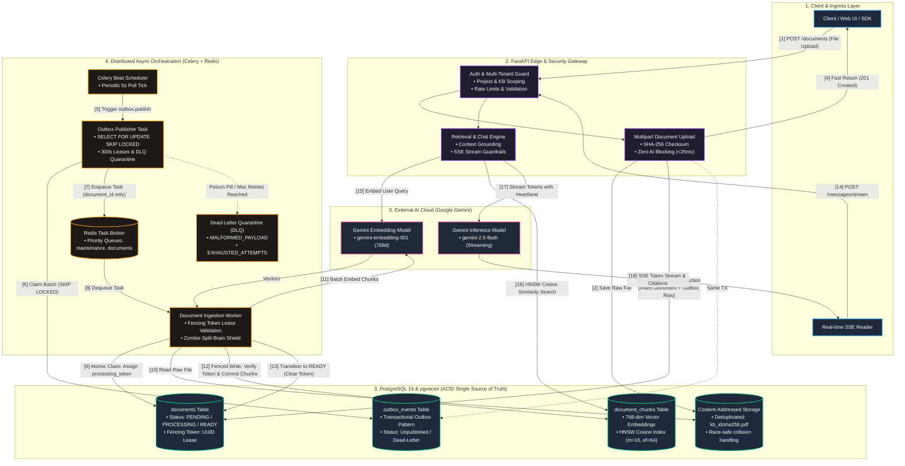
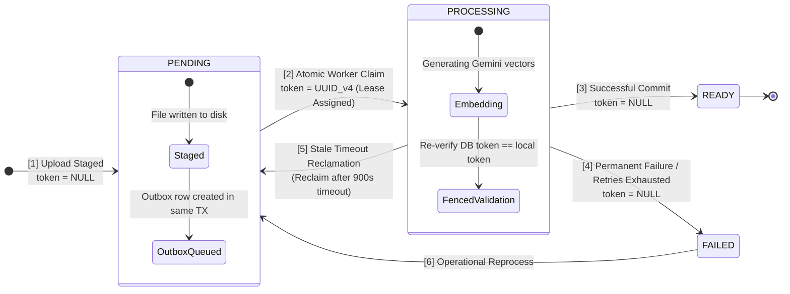
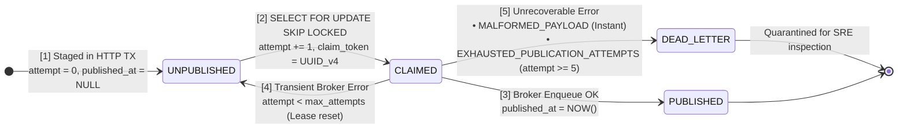
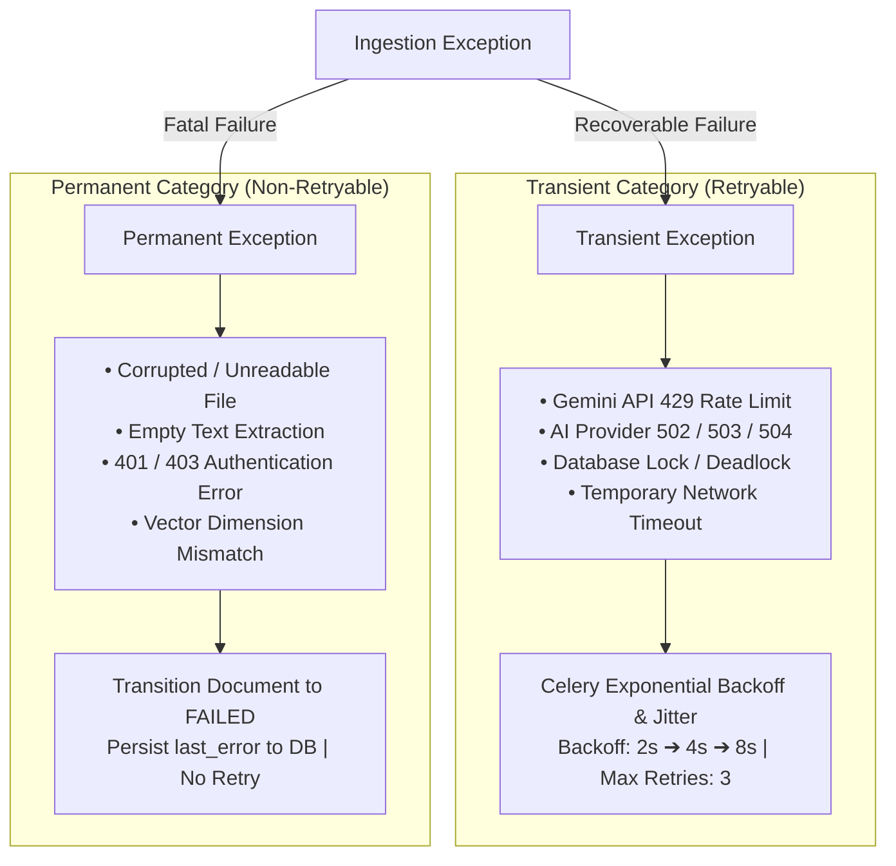

# Basic RAG Service

[](https://www.python.org/downloads/)
[](https://fastapi.tiangolo.com)
[](https://github.com/pgvector/pgvector)
[](https://docs.celeryq.dev/)
[](https://github.com/astral-sh/ruff)
[](https://github.com/detachhead/basedpyright)

A production-grade, enterprise-ready Retrieval-Augmented Generation (RAG) backend engine designed around **transactional durability, asynchronous processing pipelines, and strict consistency invariants**.

Unlike naive RAG prototypes that couple HTTP lifecycles to LLM inference or perform fragile dual-writes to message brokers, this service implements a **Transactional Outbox Pattern** with **idempotent worker consumption**, **pgvector HNSW cosine similarity search**, **HMAC-signed cursor pagination**, and **resilient Server-Sent Events (SSE) token streaming with active heartbeat monitoring**.

---

## Table of Contents

- [System Architecture](#system-architecture)
  - [Senior Engineering Highlights](#senior-engineering-highlights-why-this-architecture-stands-out)
  - [End-to-End Sequence Flow](#end-to-end-sequence-flow)
- [Technical Stack Matrix](#technical-stack-matrix)
- [Data Pipeline & Ingestion Lifecycle](#data-pipeline--ingestion-lifecycle)
  - [Document Processing State Machine & Fencing Invariants](#document-processing-state-machine--fencing-invariants)
  - [Outbox & Dead-Letter Queue (DLQ) Lifecycle](#outbox--dead-letter-queue-dlq-lifecycle)
  - [Transactional Outbox Dispatch](#transactional-outbox-dispatch)
  - [Failure Classification & Retry Policies](#failure-classification--retry-policies)
- [Retrieval & Inference Engine](#retrieval--inference-engine)
  - [Vector Indexing Strategy](#vector-indexing-strategy)
  - [SSE Streaming & Backpressure Safeguards](#sse-streaming--backpressure-safeguards)
  - [Cryptographic Cursor Pagination (v2 API)](#cryptographic-cursor-pagination-v2-api)
- [API Surface Reference](#api-surface-reference)
- [Operational Runbook & SRE Triage](#operational-runbook--sre-triage)
- [Local Development & Engineering Workflow](#local-development--engineering-workflow)

---

## System Architecture



---

### Senior Engineering Highlights (Why This Architecture Stands Out)

| Architectural Capability | The Problem It Solves | How It Is Engineered Here |
| :--- | :--- | :--- |
| **Transactional Outbox Pattern** | **The Dual-Write Bug**: Writing to a database and publishing to a broker in the same HTTP request is fundamentally non-atomic. If the broker drops or the database rolls back, data desynchronizes. | Document creation and `OutboxEvent` generation execute within the **exact same ACID transaction**. Background publishers decouple broker delivery from client HTTP latencies. |
| **Zombie Worker Fencing Tokens** | **Split-Brain Writes**: An asynchronous worker paused by network latency or a GC pause can unpause *after* its lease expires and overwrite fresh data generated by a replacement worker. | Implements **Martin Kleppmann’s Fencing Token pattern**. Every claim transaction assigns a fresh UUID `processing_token`. Every chunk persistence check executes under row lock to verify the token is still current before mutating state. |
| **High-Throughput Lock-Free Queuing** | **Database Lock Contention**: Naive database polling causes multiple worker threads to block on the same locked rows, degrading throughput. | Queries utilize `SELECT ... FOR UPDATE SKIP LOCKED`. PostgreSQL skips over locked rows without blocking, enabling linear horizontal scaling across publisher processes. |
| **Poison-Pill Quarantine & DLQ** | **Worker Starvation / Infinite Retries**: Corrupted payloads or permanent broker outages trigger endless retry loops that exhaust CPU and starve valid workloads. | Malformed payloads are immediately quarantined to `dead_lettered_at` with reason `MALFORMED_PAYLOAD`. Transient broker failures retry up to `max_outbox_attempts` before moving to `EXHAUSTED_PUBLICATION_ATTEMPTS`. |
| **Cryptographic Cursor Pagination** | **Offset Drift & Parameter Tampering**: Traditional `LIMIT/OFFSET` degrades to $O(N)$ scans and suffers page drift when new records are continuously ingested. | Implements opaque **HMAC-SHA256 signed cursor pagination** (v2 API) encoding composite sort keys with zero-downtime dual-key rotation support. |
| **Defensive SSE Token Streaming** | **Zombie HTTP Connections**: AI generation hangs or network breaks leave client streams open indefinitely, leaking server memory and file descriptors. | Enforces strict timeouts: **First-Token Watchdog** (20s), **Idle-Stream Watchdog** (30s), **Stream Heartbeat Ping** (15s `: ping`), and deferred database persistence only upon verified stream completion. |

---

### End-to-End Sequence Flow

```mermaid
sequenceDiagram
    autonumber
    actor User as Client Application
    participant API as FastAPI Gateway
    participant FS as Content-Addressed Storage
    participant DB as PostgreSQL (ACID & pgvector)
    participant Beat as Celery Beat Scheduler
    participant Pub as Outbox Publisher
    participant Broker as Redis Broker
    participant Worker as Document Worker
    participant AI as Google Gemini API

    %% -------------------------------------------------------------
    rect rgb(28, 41, 56)
    Note over User,DB: Phase 1: Fast Synchronous Write Path (<25ms, Zero AI Blocking)
    User->>API: POST /api/v1/knowledge-bases/{kb_id}/documents (Multipart Upload)
    API->>API: Validate MIME type & compute SHA-256 content checksum
    API->>FS: Persist file to kb_id/sha256.pdf (Idempotent write)
    API->>DB: BEGIN TX: Insert Document (status=PENDING, token=NULL) + Insert OutboxEvent (attempt=0)
    DB-->>API: COMMIT TX (Both persisted atomically)
    API-->>User: 201 Created (document_id, status=PENDING)
    end

    %% -------------------------------------------------------------
    rect rgb(35, 30, 24)
    Note over Beat,Broker: Phase 2: Transactional Outbox Relay Loop
    Beat->>Pub: Trigger outbox.publish (Every 5s on maintenance queue)
    Pub->>DB: SELECT * FROM outbox_events WHERE published_at IS NULL FOR UPDATE SKIP LOCKED
    Pub->>Broker: Enqueue document.process (payload: document_id only)
    Pub->>DB: UPDATE outbox_events SET published_at = NOW() WHERE claim_token = :token
    end

    %% -------------------------------------------------------------
    rect rgb(30, 25, 45)
    Note over Worker,AI: Phase 3: Asynchronous Vector Ingestion & Fenced Persistence
    Broker->>Worker: Consume document.process (document_id)
    Worker->>DB: BEGIN TX: Claim Document & assign unique processing_token = UUID_v4
    DB-->>Worker: Status: PROCESSING, Token: UUID_v4
    Worker->>FS: Stream and parse raw document text
    Worker->>Worker: Chunk text via Recursive Text Splitter (500 tokens, 50 overlap)
    Worker->>AI: Batch Generate Embeddings (gemini-embedding-001, 768 dimensions)
    AI-->>Worker: Return 768-dim vector embeddings
    Worker->>DB: SELECT FOR UPDATE: Verify processing_token == UUID_v4 (Fencing Check)
    alt Token Matches (Valid Claim)
        Worker->>DB: Bulk INSERT INTO document_chunks (HNSW indexed)
        Worker->>DB: UPDATE documents SET status='READY', processing_token=NULL
        DB-->>Worker: COMMIT TX
    else Token Mismatch (Superseded by timeout reclamation)
        Worker->>Worker: Abort & Rollback (Split-brain write prevented!)
    end
    end

    %% -------------------------------------------------------------
    rect rgb(20, 35, 30)
    Note over User,AI: Phase 4: Context-Grounded Semantic Search & Streaming RAG
    User->>API: POST /api/v1/conversations/{id}/messages/stream (User Query)
    API->>AI: Embed query with gemini-embedding-001
    AI-->>API: 768d query vector
    API->>DB: Cosine search (HNSW <=> operator) WHERE kb_id=:id AND status='ready'
    DB-->>API: Top-K grounded context chunks with similarity scores
    API->>AI: Stream prompt with citations to gemini-2.5-flash
    AI-->>API: Yield streaming token chunks
    API-->>User: Server-Sent Events (event: metadata, citations, token, complete)
    API->>DB: Persist final assistant response to message history (Deferred commit)
    end
```



---

## Technical Stack Matrix

| Layer | Technology | Version / Configuration | Design Rationale |
| :--- | :--- | :--- | :--- |
| **Runtime** | Python | `>= 3.14` | Modern type system features (`type` aliases, generic syntax `[T]`), high performance. |
| **Web Framework** | FastAPI + Uvicorn | `0.140+` | Asynchronous native request handling, automatic OpenAPI schema generation, clean dependency injection. |
| **Database & ORM** | PostgreSQL + SQLAlchemy | `2.0+` (via `psycopg3`) | Strict transactional semantics, connection pooling, typed query expressions, JSONB metadata filtering. |
| **Vector Engine** | pgvector | `0.5.0+` (HNSW Index) | Cosine similarity (`vector_cosine_ops`), avoiding multi-database operational overhead at current scale. |
| **Task Broker & Queue** | Celery + Redis | Celery `5.6+`, Redis `8.1+` | Distributed task execution, automatic retries with exponential backoff & jitter, multi-queue topology. |
| **LLM & Embeddings** | Google Gemini | `gemini-embedding-001` (768d)<br>`gemini-2.5-flash` | Enterprise-grade context windows, high token velocity, cost-efficient vector representation. |
| **Streaming Protocol** | Server-Sent Events | `sse-starlette` | Standard HTTP streaming for unidirectional tokens without WebSocket state overhead. |
| **Tooling & Linter** | uv, Ruff, BasedPyright | Latest | Ultra-fast virtual environment sync, strict static typing, zero-tolerance code style enforcement. |

---

## Data Pipeline & Ingestion Lifecycle

### Document Processing State Machine & Fencing Invariants



#### Document Status & Token Invariant Rules
- **`PENDING`** (`processing_token = NULL`): File persisted to content-addressed storage, document committed to DB, and outbox event staged in the same ACID transaction.
- **`PROCESSING`** (`processing_token = UUID_v4`): Document claimed by worker via `SELECT ... FOR UPDATE`. Text extracted, chunked, and embeddings generated with Gemini. All mutations are strictly fenced by this active token.
- **`READY`** (`processing_token = NULL`): Vector chunks successfully committed to `document_chunks` table with HNSW index. Token cleared. Document is live for semantic search.
- **`FAILED`** (`processing_token = NULL`): Non-recoverable error encountered or transient retry ceiling reached. Error diagnostic logged in `last_error` and token cleared.

---

### Outbox & Dead-Letter Queue (DLQ) Lifecycle



#### Outbox Lifecycle States
- **`UNPUBLISHED`**: Event staged in PostgreSQL (`published_at = NULL`, `attempt_count = 0`). Awaiting publisher sweep.
- **`CLAIMED`**: Leased by an active publisher instance using `SELECT ... FOR UPDATE SKIP LOCKED` (`claim_token = UUID`, 300s lease window, `attempt_count` incremented).
- **`PUBLISHED`**: Successfully published to Redis broker (`published_at = NOW()`, lease cleared).
- **`DEAD_LETTER`**: Quarantined with `dead_lettered_at = NOW()` due to `MALFORMED_PAYLOAD` (poison pill) or `EXHAUSTED_PUBLICATION_ATTEMPTS` (broker retry limit reached). Never silently dropped.

---

### Transactional Outbox Dispatch

To eliminate race conditions between multiple Celery beat executions or distributed publisher workers, outbox processing uses lease-based, non-blocking row claiming:

```sql
SELECT id, event_type, aggregate_id, payload
FROM outbox_events
WHERE published_at IS NULL
  AND (claimed_at IS NULL OR claimed_at < NOW() - INTERVAL '300 seconds')
ORDER BY created_at ASC, id ASC
LIMIT 100
FOR UPDATE SKIP LOCKED;
```

#### Claim & Fencing Token Protocol
1. The publisher generates an ephemeral `claim_token = uuid4()`.
2. Staged rows are claimed with `claimed_at = NOW()` and `claim_token = :token`.
3. Tasks are dispatched to Redis.
4. Rows are marked published only if `claim_token` still matches:
   ```sql
   UPDATE outbox_events
   SET published_at = NOW(), claimed_at = NULL, claim_token = NULL, last_error = NULL
   WHERE id = :event_id AND published_at IS NULL AND claim_token = :claim_token;
   ```

---

### Failure Classification & Retry Policies

Failures are strictly categorized into **Transient** (retryable) and **Permanent** (non-retryable):



The Celery ingestion task uses a custom `DocumentProcessTask` base class that hooks into `on_failure` to automatically transition documents to `FAILED` and record the truncated error message in PostgreSQL once the retry budget is exhausted.

---

## Retrieval & Inference Engine

### Vector Indexing Strategy

Document chunks are mapped into a 768-dimensional space using `gemini-embedding-001` (configurable via `GEMINI_EMBEDDING_MODEL`). Retrieval runs through an **HNSW index** optimized for cosine distance:

```sql
CREATE INDEX IF NOT EXISTS ix_document_chunks_embedding_hnsw
ON document_chunks
USING hnsw (embedding vector_cosine_ops)
WITH (m = 16, ef_construction = 64);
```

Search queries enforce status validation, ensuring **only chunks from `READY` documents in the target knowledge base** are evaluated:

```sql
SELECT dc.id, dc.content, dc.metadata, (1 - (dc.embedding <=> :query_vector)) AS similarity
FROM document_chunks dc
JOIN documents d ON d.id = dc.document_id
WHERE d.knowledge_base_id = :kb_id
  AND d.status = 'ready'
  AND (1 - (dc.embedding <=> :query_vector)) >= :threshold
ORDER BY dc.embedding <=> :query_vector
LIMIT :top_k;
```

---

### SSE Streaming & Backpressure Safeguards

The streaming chat endpoint (`/api/v1/conversations/{id}/messages/stream`) adheres to a structured event envelope:

```
event: metadata
data: {"conversation_id": "...", "message_id": "..."}

event: citations
data: [{"document_id": "...", "chunk_id": "...", "snippet": "...", "score": 0.89}]

event: token
data: {"content": "Retrieval"}

event: token
data: {"content": "-Augmented"}

event: complete
data: {"finish_reason": "stop", "total_tokens": 342}
```

#### Defensive Streaming Controls
* **First-Token Watchdog**: Terminates with `event: error` if the upstream LLM takes $>20\text{s}$ to yield initial output.
* **Idle-Stream Watchdog**: Terminates if chunks stall for $>30\text{s}$ mid-generation.
* **Stream Heartbeat Ping**: Transmits `: ping` comment every 15 seconds to prevent intermediate proxy/load-balancer connection drops.
* **Deferred Persistence**: Assistant responses are committed to PostgreSQL **only after complete, verified stream finalization**, preventing corrupted or partial answers from polluting conversation history.

---

### Cryptographic Cursor Pagination (v2 API)

The v2 endpoints implement opaque, stateless, signed cursor pagination. Cursors are generated using **HMAC-SHA256** digests:

$$\text{Cursor} = \text{Base64UrlEncode}\Big(\text{JSON}(\text{Payload}) \,\|\, \text{HMAC-SHA256}_{\text{key}}(\text{Payload})\Big)$$

* **Tamper Proof**: Clients cannot alter sort keys, resource scopes, or offsets.
* **Dual-Key Rotation**: Supports zero-downtime key rotation via `CURSOR_SIGNING_KEY` (primary signer) and `CURSOR_PREVIOUS_SIGNING_KEY` (fallback verifier).

---

## API Surface Reference

### Core Endpoints

| Method | Route | Description | Status Code | Deprecation |
| :--- | :--- | :--- | :--- | :--- |
| `GET` | `/health` | Liveness and health check | `200 OK` | — |
| `POST` | `/api/v1/knowledge-bases/{kb_id}/documents` | Multipart document upload (Enqueue ingestion) | `201 Created` | — |
| `POST` | `/api/v1/knowledge-bases/{kb_id}/search` | Semantic vector search | `200 OK` | — |
| `POST` | `/api/v1/knowledge-bases/{kb_id}/conversations` | Initialize knowledge base conversation | `201 Created` | — |
| `GET` | `/api/v1/conversations/{id}` | Fetch conversation entity | `200 OK` | — |
| `DELETE`| `/api/v1/conversations/{id}` | Delete conversation and cascade messages | `204 No Content` | — |
| `POST` | `/api/v1/conversations/{id}/messages` | Synchronous context-grounded chat | `200 OK` | — |
| `POST` | `/api/v1/conversations/{id}/messages/stream`| Real-time SSE token streaming | `200 OK` | — |
| `GET` | `/api/v1/knowledge-bases/{kb_id}/conversations` | Offset pagination for conversations | `200 OK` | **Deprecated** (`use v2`) |
| `GET` | `/api/v1/conversations/{id}/messages` | Offset pagination for messages | `200 OK` | **Deprecated** (`use v2`) |
| `GET` | `/api/v2/knowledge-bases/{kb_id}/conversations` | Signed cursor conversation pagination | `200 OK` | — |
| `GET` | `/api/v2/conversations/{id}/messages` | Signed cursor message pagination | `200 OK` | — |

---

## Operational Runbook & SRE Triage

### 1. Triaging Unpublished Outbox Backlog
If documents are stuck in `PENDING`, verify whether the outbox queue is publishing:

```sql
SELECT 
    event_type,
    COUNT(*) AS total_backlog,
    MAX(attempt_count) AS max_attempts,
    MIN(created_at) AS oldest_pending_event
FROM outbox_events
WHERE published_at IS NULL
GROUP BY event_type;
```

**Remediation**:
1. Check Celery Beat logs: Ensure `celery_app beat` is active and scheduling `outbox.publish`.
2. Verify the `maintenance` queue worker:
   ```bash
   uv run celery -A app.worker.celery_app:celery_app inspect active --queues=maintenance
   ```

---

### 2. Identifying Zombie `PROCESSING` Documents
If workers crash mid-execution or during a retry backoff pause, documents may remain in `PROCESSING`:

```sql
SELECT 
    id, 
    filename, 
    knowledge_base_id, 
    retry_count, 
    last_error,
    processing_started_at,
    updated_at
FROM documents
WHERE status = 'processing'
  AND COALESCE(processing_started_at, updated_at) < NOW() - INTERVAL '15 minutes';
```

---

### 3. Reviewing Failed Ingestion Root Causes
To inspect permanent failures or exhausted retry states:

```sql
SELECT 
    id,
    filename,
    retry_count,
    last_error,
    updated_at
FROM documents
WHERE status = 'failed'
ORDER BY updated_at DESC
LIMIT 20;
```

---

## Local Development & Engineering Workflow

### Prerequisites
* **Python 3.14+**
* **Docker & Docker Compose** (for PostgreSQL + pgvector & Redis)
* **uv** package manager (`curl -LsSf https://astral.sh/uv/install.sh | sh`)
* **Google Gemini API Key**

---

### 1. Environment & Infrastructure Setup

```bash
# 1. Clone repository
git clone https://github.com/your-org/basic-rag.git
cd basic-rag

# 2. Initialize environment configuration
make env

# 3. Synchronize virtual environment dependencies with uv
make sync

# 4. Spin up PostgreSQL (pgvector) and Redis
make docker-up
```

Update `.env` with your Google Gemini credentials:
```env
GOOGLE_API_KEY=your_actual_gemini_api_key
CURSOR_SIGNING_KEY=your-32-char-random-secret-key
```

---

### 2. Database Migrations

Apply all Alembic database migrations:

```bash
make migrate
```

---

### 3. Running Services

Open separate terminal windows or use a process manager:

```bash
# Terminal 1: FastAPI Gateway Server
make dev

# Terminal 2: Celery Worker (Documents & Maintenance Queues)
uv run celery -A app.worker.celery_app:celery_app worker \
  --queues=documents,maintenance \
  --concurrency=2 \
  --loglevel=INFO

# Terminal 3: Celery Beat Scheduler (Outbox Publisher)
uv run celery -A app.worker.celery_app:celery_app beat \
  --loglevel=INFO
```

The interactive API documentation is available at `http://127.0.0.1:8000/docs`.

---

### 4. Code Quality, Typing & Test Suite

The project enforces strict typing and linting standards:

```bash
# Format codebase with Ruff
make format

# Run full linting, format checks, and static typechecks (BasedPyright)
make check

# Execute complete Pytest test suite with coverage report
make test-cov

# Run full pre-commit verification pipeline
make verify
```

---

## License

Distributed under the MIT License. See `LICENSE` for more information.